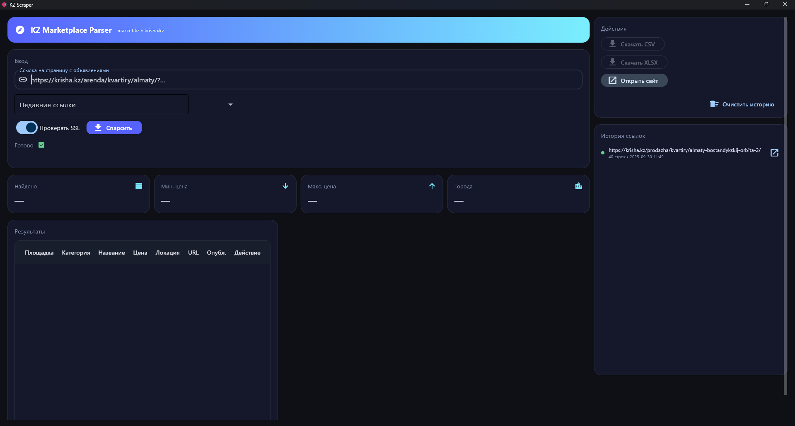

---
````markdown
<!-- PROJECT HEADER -->
<h1 align="center">KZ Marketplace Parser</h1>

<p align="center">
  A tiny, batteries-included desktop app for scraping listings from <b>krisha.kz</b> and <b>market.kz</b>.
  Paste a search URL, hit <b>Parse</b>, and export the results to <b>CSV/XLSX</b>.
  Built with <a href="https://flet.dev" target="_blank">Flet</a> for a clean, native-feeling Python UI.
</p>

<p align="center">
  <!-- Badges -->
  <a href="https://www.python.org/"></a>
  <a href="https://flet.dev"></a>
  
  <a href="#license"></a>
  
</p>

<p align="center">
  
</p>

---

## Table of Contents
- [TL;DR](#tldr)
- [Features](#features)
- [Quickstart](#quickstart)
- [Tech & Tools](#tech--tools)
- [Architecture](#architecture)
- [How It Works](#how-it-works)
- [Structure](#structure)
- [FAQ](#faq)
- [Contributing](#contributing)
- [License](#license)

---

## TL;DR

- Paste a list/search page URL from **krisha.kz** or **market.kz**  
- The app fetches the page, parses listing cards, and shows a table  
- One click to export **CSV** or **XLSX**, plus a handy **history** panel

**Example link to try** (also pin it in history if you like):
- https://krisha.kz/prodazha/kvartiry/almaty-bostandykskij-orbita-2/

---

## Features

-  **Two marketplaces** out of the box: krisha.kz & market.kz  
-  **Exports** to CSV and (optionally) XLSX  
-  **Smart parsing**: price extraction, coarse category & city detection  
-  **Robust HTTP**: retry/backoff, random User-Agent, optional SSL verification  
-  **URL History** persisted to `history.json`, surfaced in the UI

> Dependencies are in `requirements.txt` (Flet, Requests, BeautifulSoup, lxml, Pandas, OpenPyXL).

---

## Quickstart

```bash
# 1) Create & activate a virtual environment (recommended)
python -m venv .venv
# Windows
.venv\Scripts\activate
# macOS/Linux
source .venv/bin/activate

# 2) Install deps
pip install -r requirements.txt

# 3) Run the app
python main.py
````

> XLSX export uses `openpyxl`. If you skip it, CSV export still works.

---

## Tech & Tools

<p>
  
  
  
  
  
  
</p>

---

## Architecture

```
+-----------------------------+         +------------------------+
|           UI (Flet)         |  calls  |        Scraper         |
|         main.py             +-------> |   parser/core.py       |
| - Input URL                 |         | - Domain routing       |
| - Parse / Export buttons    |         | - HTTP + retries       |
| - KPIs & Results table      |         | - Exports (CSV/XLSX)   |
| - History sidebar           |         +-----+------------------+
+--------------+--------------+               |
               |                              |
               | uses                         | uses
               v                              v
        +--------------+                +-------------+
        |  Adapters    |                |   Utils     |
        | parser/      |                | parser/     |
        | adapters.py  |                | utils.py    |
        | - Krisha     |                | - price()   |
        | - MarketKZ   |                | - detect_*  |
        +--------------+                +-------------+
```

* **UI (`main.py`)** — presentation & user actions only (decoupled from site specifics).
* **Scraper (`parser/core.py`)** — orchestrates domain detection, fetching, retries/backoff, UA rotation, and export.
* **Adapters (`parser/adapters.py`)** — *pure extraction* per website (BeautifulSoup).
* **Utils (`parser/utils.py`)** — helper functions (price parsing, city/category heuristics, formatting).
* **Public API (`parser/__init__.py`)** — re-exports `Scraper` / `ScrapeResult` for clean imports.

---

## How It Works

1. You paste a URL and click **Parse**.
2. `Scraper.scrape_url(url)`:

   * picks an adapter by domain (`krisha.kz` / `market.kz`);
   * downloads HTML with retries/backoff and random UA (optional SSL off);
   * calls `adapter.extract(html, page_url)` → list of items (dict per listing);
   * builds a DataFrame and writes **CSV** and (if installed) **XLSX**.
3. The UI fills the table & KPIs and enables export buttons.
4. The URL and rows count are saved to `history.json` with a timestamp.

**Item schema (typical):**

```jsonc
{
  "marketplace": "krisha.kz" | "market.kz",
  "category": "Квартиры" | "Дома" | "Коммерческая" | "Участки" | "Гаражи" | "Другое",
  "title": "…",
  "price": 123456,
  "description": "short text…",
  "seller": "Не указан",
  "location": "Алматы" | "Не указано",
  "date_posted": "Не указано",
  "url": "https://…",
  "scraped_at": "YYYY-MM-DD HH:MM:SS"
}
```

Heuristics: prefer numbers with `₸/тг/тенге`; otherwise take the largest “reasonable” number (≥ 10 000) to avoid area/floor noise. City & category detection are simple keyword rules you can extend.

---

## Structure

```
parser/
  __init__.py        # re-exports Scraper & ScrapeResult
  adapters.py        # site-specific extractors (krisha.kz, market.kz)
  core.py            # Scraper orchestration (HTTP, retries, export)
  utils.py           # helpers: price parser, city & category detection
main.py              # Flet UI (panels, table, exports, history)
requirements.txt     # dependencies
history.json         # (runtime) parsed URLs history
docs/
  screenshot-ui.png  # UI screenshot used above
```

---

## FAQ

**“Domain not supported.”**
Only `krisha.kz` and `market.kz` are wired. Add a new adapter and register it in the router.